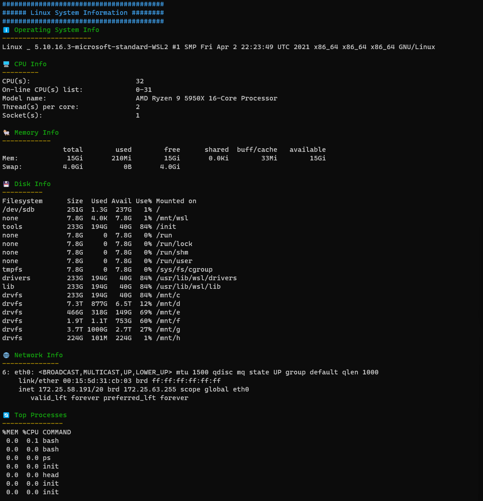

# Linux System Information Script 🖥️

## Overview

The Linux System Information Script is an interactive Bash script designed to gather various types of system information. The script displays details about the operating system, CPU, memory, disk, network, and top processes, all in an easy-to-read format.



## Features

- 🌈 Colorful and Interactive Output
- ℹ️ Comprehensive System Information
- 🖥️ CPU Details
- 🐏 Memory Usage
- 💾 Disk Information
- 🌐 Network Status
- 🔄 Top Processes

## Installation

1. Clone the repository:

    ```bash
    git clone https://github.com/YourUsername/Linux-System-Information-Script.git
    ```

2. Navigate to the script's directory:

    ```bash
    cd Linux-System-Information-Script
    ```

3. Make the script executable:

    ```bash
    chmod +x linux_system_info.sh
    ```

## Usage

To run the script, simply execute:

```bash
./linux_system_info.sh
```

Follow the on-screen prompts to view the system information.

## Requirements

- Bash
- sudo access (for some commands)

## Contributing

Contributions are welcome! Feel free to fork the repository and submit pull requests.

## License

This project is licensed under the MIT License - see the [LICENSE.md](LICENSE.md) file for details.
